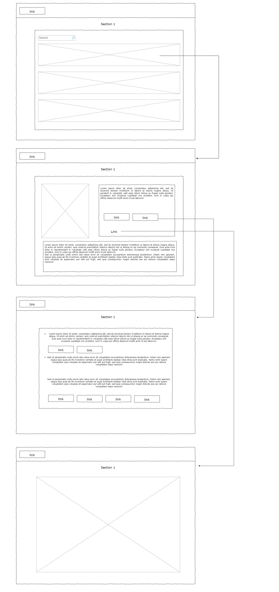

# Laboratorio 2024 RIA

## Descripción

El presente es un proyecto inspirado en una Pokedex (enciclopedia electrónica portatil) utilizando la API Rest [PokeApi v2](https://github.com/angular/angular-cli), en donde se visualizan las diferentes especies de pokémon que existen. La interfaz es intuitiva y permite encontrar a los pokémon mediante su tipo de manera rápida. También se agregaron filtros para realizar una búsqueda más ágil por nombre y orden alfabético. Al seleccionar un pokémon de la lista, se muestra su información relacionada.

La solución hace uso de mas de dos componentes en angular que intercambian información, la página principal que lista a los pokémons permite seleccionar uno. Esta información se envía al componente número dos al seleccionar un pokémon de las lista, recibe el ‘id’ y muestra su información.

Componentes visuales utilizados: tablas, botones, paginación, input de búsqueda.

## Integrantes del Proyecto

* Santiago Gamarra
* Juan Marín
* Anna Torres
* Jonatan Marroco

## Instalación

Se debe de tener Node version 20.14.0 o superior.

Comandos para iniciar (Desarrollo):
* npm install
* npm start
Colocar URL en el navegador o hacer ctrl + click en la URL que se muestra en la terminal.

Comandos para iniciar (Docker):
(Utilizamos Docker 4.31.1)
* docker build --pull --rm -f "Dockerfile" -t lab2ria:v1 "."
* docker run --rm -d -p 80:80/tcp lab2ria:v1
Con los comandos utilizados, la aplicación de lanza en localhost:80.

## Tecnologías Utilizadas

* Angular + Bootstrap
* Consumo de API Rest

Angular: 
  * Framework desarrollado en typescript, que permite realizar aplicaciones web de una sola página o SPA y aplicaciones web      dinámicas. Angular sigue el patrón de arquitectura de software Modelo-Vista-Controlador (MVC).

Bootstrap: 
  * Framework que proporciona herramientas para el desarrollo de aplicaciones web responsive. Combina CSS y JavaScript para      estilizar elementos HTML

## Historia de Usuario

Como usuario frecuente de la aplicación pokémon, quiero poder obtener la información necesaria para poder jugar en competencias con otros usuarios de manera eficiente.

## Mockups

